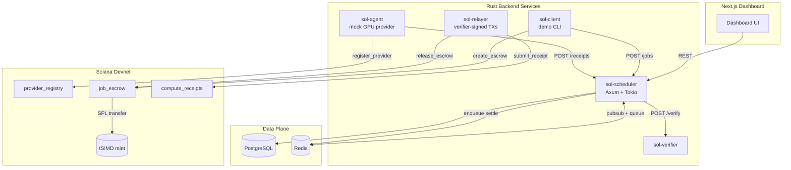
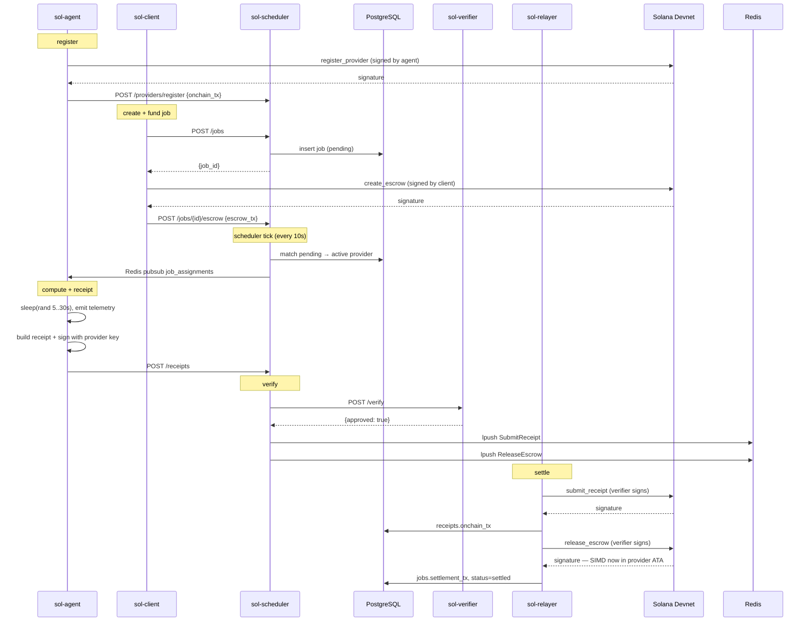

# SolGrid — GPU Compute Settlement on Solana

A demo-grade GPU compute settlement platform for CFD workloads, settling
on Solana Devnet with a tSIMD SPL token. Three Anchor programs, six Rust
services, a Postgres + Redis data plane, and a Next.js dashboard.

> [!IMPORTANT]
> **SIMD token note.** The real SIMD token
> (`EMeugag3yfyvKqNKknGDWAudNALafZjbv9ByzCE8pump`) is a pump.fun token
> deployed only on **mainnet**. This demo targets **devnet**, so it
> creates a separate **tSIMD** ("test SIMD") mint on devnet via
> `sol-client setup-mint`. The settlement code path is identical — only
> the mint address differs — so swapping in the real SIMD mint and
> redeploying against mainnet is a one-line `.env` change.

---

## Architecture



**Who signs what?** This is the most important detail to grok:

| Transaction         | Signer              | Submitted by  |
| ------------------- | ------------------- | ------------- |
| `register_provider` | Provider's keypair  | `sol-agent`   |
| `create_escrow`     | Client's keypair    | `sol-client`  |
| `submit_receipt`    | Verifier authority  | `sol-relayer` |
| `release_escrow`    | Verifier authority  | `sol-relayer` |

Each actor signs the on-chain ops they're allowed to. The relayer never
holds anyone else's keys — it only owns the verifier authority and only
sees the queue *after* a receipt has been validated off-chain by
`sol-verifier`.

---

## Repo layout

```
sol/
├── Anchor.toml                     # Anchor config (program IDs + cluster)
├── Cargo.toml                      # Cargo workspace root
├── docker-compose.yml              # Local stack
├── .env.example
├── scripts/setup-devnet.sh         # One-shot devnet bootstrap
├── proto/                          # Canonical message schemas
├── programs/                       # Anchor on-chain programs
│   ├── provider-registry/
│   ├── job-escrow/
│   └── compute-receipts/
├── crates/                         # Off-chain Rust services
│   ├── sol-common/                 # shared types, crypto, config
│   ├── sol-onchain/                # PDA derivation + ix builders
│   ├── sol-db/                     # sqlx queries + migrations
│   ├── sol-scheduler/              # REST API (Axum)
│   ├── sol-verifier/               # receipt validator (Axum)
│   ├── sol-relayer/                # verifier-signed TX submitter
│   ├── sol-agent/                  # mock GPU provider
│   └── sol-client/                 # demo CLI
├── frontend/                       # Next.js 16 dashboard
└── docker/                         # one Dockerfile per service
```

---

## Anchor programs

Three programs, each using PDAs and (where applicable) SPL Token CPI.

### `provider-registry`
- **PDA**: `[b"provider", authority]`
- Instructions: `register_provider`, `update_provider`

### `job-escrow`
- **PDAs**: `[b"escrow", job_id]` and `[b"vault", job_id]` (vault is the SPL token account)
- Instructions: `create_escrow`, `release_escrow`, `refund_escrow`
- Uses `anchor_spl::token_interface::transfer_checked` for SPL token CPI in/out of the vault PDA

### `compute-receipts`
- **PDA**: `[b"receipt", job_id]`
- Instructions: `submit_receipt`
- Stores the full receipt struct (job_id, provider, gpu_class, gpu_count, duration, scu_amount, result_hash, provider_signature, verifier)

The 32-byte `job_id` is the UUIDv4 of the DB job, zero-padded.

---

## End-to-end flow



---

## Compute receipt schema

The off-chain `ComputeReceiptData` (in `sol-common::types`) and the
on-chain `ComputeReceipt` account share these fields:

```text
job_id                 [u8; 32]   UUIDv4 padded to 32 bytes
provider_pubkey        Pubkey
gpu_class              string<=16
gpu_count              u8
execution_duration_sec u32
scu_amount             u64
result_hash            [u8; 32]   SHA-256(job_id || provider || duration)
provider_signature     [u8; 64]   Ed25519 over the canonical message
verifier               Pubkey     set on-chain at submit
```

`scu_amount = gpu_count × duration × class_multiplier` (H100=10, A100=8, …).

---

## Prerequisites

- Rust 1.95+ (`rustup install stable`)
- Anchor CLI **0.32.1** (must match `anchor-lang` version)
- Solana CLI 2.x or Agave 3.x
- Docker + Docker Compose
- Node.js 24+ (for the frontend)

```bash
solana --version              # solana-cli 3.x (Agave)
anchor --version              # anchor-cli 0.32.1
cargo --version
```

---

## Devnet bootstrap (one shot)

```bash
cp .env.example .env
./scripts/setup-devnet.sh
```

This script:
1. Switches the Solana CLI to devnet
2. Airdrops 2 SOL to the deployer (`~/.config/solana/id.json`)
3. Generates the verifier keypair at `./data/verifier-keypair.json`
4. Runs `anchor build && anchor deploy`
5. Captures the three deployed program IDs into `.env` + `Anchor.toml`
6. Creates the tSIMD mint and writes the address to `.env`
7. Mints 1,000,000 tSIMD to the demo client wallet

Re-running is safe — every step is idempotent.

---

## Running locally

```bash
# Data layer
docker compose up -d postgres redis

# Apply schema
psql "$DATABASE_URL" -f crates/sol-db/migrations/001_initial.sql

# Backend services (in separate panes / tmux)
cargo run -p sol-scheduler
cargo run -p sol-verifier
cargo run -p sol-relayer
cargo run -p sol-agent       # first run: registers on-chain

# Frontend
cd frontend && npm install && npm run dev
```

Dashboard: <http://localhost:3000>.

---

## Triggering a demo job

```bash
cargo run -p sol-client -- create-job --budget-scu 50000
```

Output (abridged):

```
job created: 7f1a…
create_escrow tx: 5cYj…
explorer:         https://explorer.solana.com/tx/5cYj…?cluster=devnet
Job 7f1a… funded and ready for assignment.
```

Within ~10s the scheduler picks it up, the agent simulates compute,
submits a signed receipt, the verifier approves it, and the relayer
fires `submit_receipt` + `release_escrow`. Open the explorer link to
see the SPL transfer of tSIMD from the vault PDA to the provider's ATA.

---

## sol-client CLI reference

```text
sol-client keygen [--path PATH] [--force]
sol-client airdrop [--amount-sol 1.0]
sol-client balance
sol-client setup-mint [--decimals 6]
sol-client mint-to AMOUNT
sol-client create-job [--gpu-class A100] [--gpu-count 4]
                      [--max-duration-sec 120] [--budget-scu 50000]
sol-client status JOB_ID
```

`CLIENT_KEYPAIR_PATH` overrides the default `./data/client-keypair.json`.

---

## REST API (sol-scheduler)

| Method | Path                            | Body                       |
| ------ | ------------------------------- | -------------------------- |
| POST   | `/api/v1/providers/register`    | `RegisterProviderRequest`  |
| GET    | `/api/v1/providers`             | —                          |
| GET    | `/api/v1/providers/:id`         | —                          |
| POST   | `/api/v1/jobs`                  | `CreateJobRequest`         |
| GET    | `/api/v1/jobs` / `/jobs/:id`    | —                          |
| POST   | `/api/v1/jobs/:id/assign`       | —                          |
| POST   | `/api/v1/jobs/:id/escrow`       | `AttachEscrowTxRequest`    |
| POST   | `/api/v1/receipts`              | `ComputeReceiptData`       |
| GET    | `/api/v1/receipts` / `:job_id`  | —                          |
| GET    | `/api/v1/stats`                 | dashboard summary          |

`sol-verifier` exposes one endpoint: `POST /api/v1/verify` (called by
the scheduler, not by the public).

---

## What's real vs. mocked

| Layer                | State                                              |
| -------------------- | -------------------------------------------------- |
| Anchor programs      | real, deployable to devnet                         |
| SPL token settlement | real, devnet tSIMD                                 |
| Provider keypair     | persisted to disk                                  |
| GPU compute          | simulated (sleep + fake telemetry)                 |
| Result hash          | deterministic `sha256(job_id ‖ provider ‖ duration)` |

The verifier's SCU bounds are advisory thresholds — a real production
deployment would attest GPU work via a TEE / proof-of-compute oracle.

---

## Not yet wired

Deliberate gaps in this iteration:

- Wallet-connect "Create Job" button on the Next.js frontend (Next.js 16
  has breaking changes; pulling in `@solana/wallet-adapter` is its own
  effort). Use the CLI for now.
- `tests/integration/full_flow.rs` — the live demo currently substitutes
  for an integration test.
- Refund flow surfaced through the API (the Anchor instruction exists).

---

## Local development tips

- `cargo check --workspace` runs in seconds — use it during edits.
- `cargo build --workspace --exclude provider-registry --exclude job-escrow --exclude compute-receipts`
  builds the off-chain services without invoking the BPF toolchain.
- `anchor build` rebuilds the three programs.
- `RUST_LOG=sol_relayer=trace cargo run -p sol-relayer` to inspect every
  RPC call.
